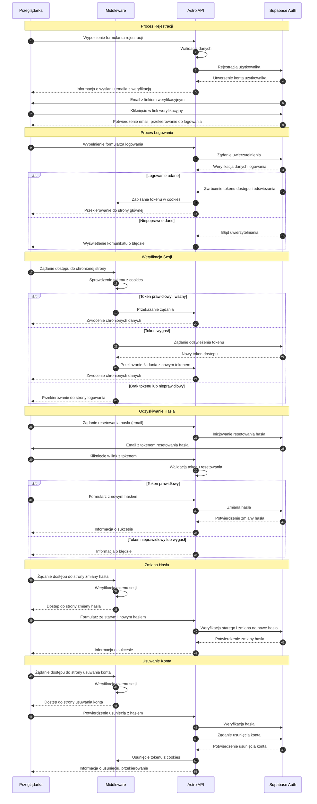

<authentication_analysis>
1. Przepływy autentykacji:
   - Rejestracja (signUp)
   - Logowanie (signInWithPassword)
   - Wylogowanie (signOut)
   - Zapomniane hasło (send reset link)
   - Reset hasła (verify token + update)
   - Zmiana hasła (re-authenticate + update)
   - Usunięcie konta (re-authenticate + soft delete)
   - Ochrona tras (middleware protectRoute)
   - Odświeżanie tokenu (middleware przed wygaśnięciem)

2. Główni aktorzy i ich interakcje:
   - Browser: wysyła żądania i odbiera odpowiedzi
   - Middleware: weryfikuje/odświeża tokeny i chroni trasy
   - AstroAPI: punkt końcowy /api/auth/* wykonujący operacje
   - SupabaseAuth: realizuje operacje signUp, signIn, signOut, token refresh

3. Proces weryfikacji i odświeżania tokenów:
   - Middleware odczytuje access_token i refresh_token z ciastek
   - Jeśli access_token ważny → kontynuacja SSR
   - Gdy access_token wygasł → wywołanie odświeżenia przez SupabaseAuth
   - SupabaseAuth zwraca nowe tokeny, middleware je ustawia

4. Krótki opis każdego kroku:
   - Żądanie zasobu chronionego → middleware weryfikuje sesję
   - Rejestracja/logowanie → AstroAPI używa SupabaseAuth i zwraca sesję
   - Zapomniane hasło → generowanie i wysłanie linku resetu
   - Reset hasła → weryfikacja tokenu i aktualizacja hasła
   - Zmiana hasła → re-autoryzacja i updateUser
   - Usunięcie konta → re-autoryzacja, soft delete, wylogowanie
</authentication_analysis>

<mermaid_diagram>

sequenceDiagram
  autonumber
  participant Browser
  participant Middleware
  participant AstroAPI
  participant SupabaseAuth

  activate Browser
  Browser->>Middleware: Żądanie zasobu chronionego
  activate Middleware
  Middleware->>Middleware: Sprawdź access_token
  alt Token ważny
    Middleware->>AstroAPI: SSR żądanie + sesja
    deactivate Middleware
    activate AstroAPI
    AstroAPI->>Browser: Render strony z sesją
    deactivate AstroAPI
  else Token wygasł lub brak
    Middleware->>SupabaseAuth: Odśwież token (refresh_token)
    activate SupabaseAuth
    SupabaseAuth-->>Middleware: Nowe tokeny
    deactivate SupabaseAuth
    Middleware->>Browser: Ustaw ciasteczka
    Middleware-->>Browser: Retry / żądanie zasobu
    deactivate Middleware
  end

  %% Rejestracja
  activate Browser
  Browser->>AstroAPI: POST /api/auth/register
  activate AstroAPI
  AstroAPI->>SupabaseAuth: signUp({email,password})
  activate SupabaseAuth
  SupabaseAuth-->>AstroAPI: {session}
  deactivate SupabaseAuth
  AstroAPI->>Browser: Set cookies + redirect /topics
  deactivate AstroAPI
  deactivate Browser

  %% Logowanie
  Browser->>AstroAPI: POST /api/auth/login
  activate AstroAPI
  AstroAPI->>SupabaseAuth: signInWithPassword({email,password})
  activate SupabaseAuth
  SupabaseAuth-->>AstroAPI: {session}
  deactivate SupabaseAuth
  AstroAPI->>Browser: Set cookies + redirect /topics
  deactivate AstroAPI

  %% Zapomniane hasło
  Browser->>AstroAPI: POST /api/auth/forgot-password
  activate AstroAPI
  AstroAPI->>SupabaseAuth: sendResetEmail
  activate SupabaseAuth
  SupabaseAuth-->>AstroAPI: success
  deactivate SupabaseAuth
  AstroAPI->>Browser: Banner potwierdzenia
  deactivate AstroAPI

  %% Reset hasła
  Browser->>AstroAPI: POST /api/auth/reset-password
  activate AstroAPI
  AstroAPI->>SupabaseAuth: verifyToken + updatePassword
  activate SupabaseAuth
  SupabaseAuth-->>AstroAPI: success
  deactivate SupabaseAuth
  AstroAPI->>Browser: Redirect /login + komunikat
  deactivate AstroAPI

  %% Zmiana hasła
  Browser->>AstroAPI: PUT /api/auth/change-password
  activate AstroAPI
  AstroAPI->>SupabaseAuth: re-authenticate + updateUser
  activate SupabaseAuth
  SupabaseAuth-->>AstroAPI: success
  deactivate SupabaseAuth
  AstroAPI->>Browser: Banner potwierdzenia
  deactivate AstroAPI

  %% Usunięcie konta
  Browser->>AstroAPI: DELETE /api/auth/delete-account
  activate AstroAPI
  AstroAPI->>SupabaseAuth: re-authenticate + softDelete
  activate SupabaseAuth
  SupabaseAuth-->>AstroAPI: success
  deactivate SupabaseAuth
  AstroAPI->>Browser: Clear cookies + redirect /login
  deactivate AstroAPI
</mermaid_diagram>