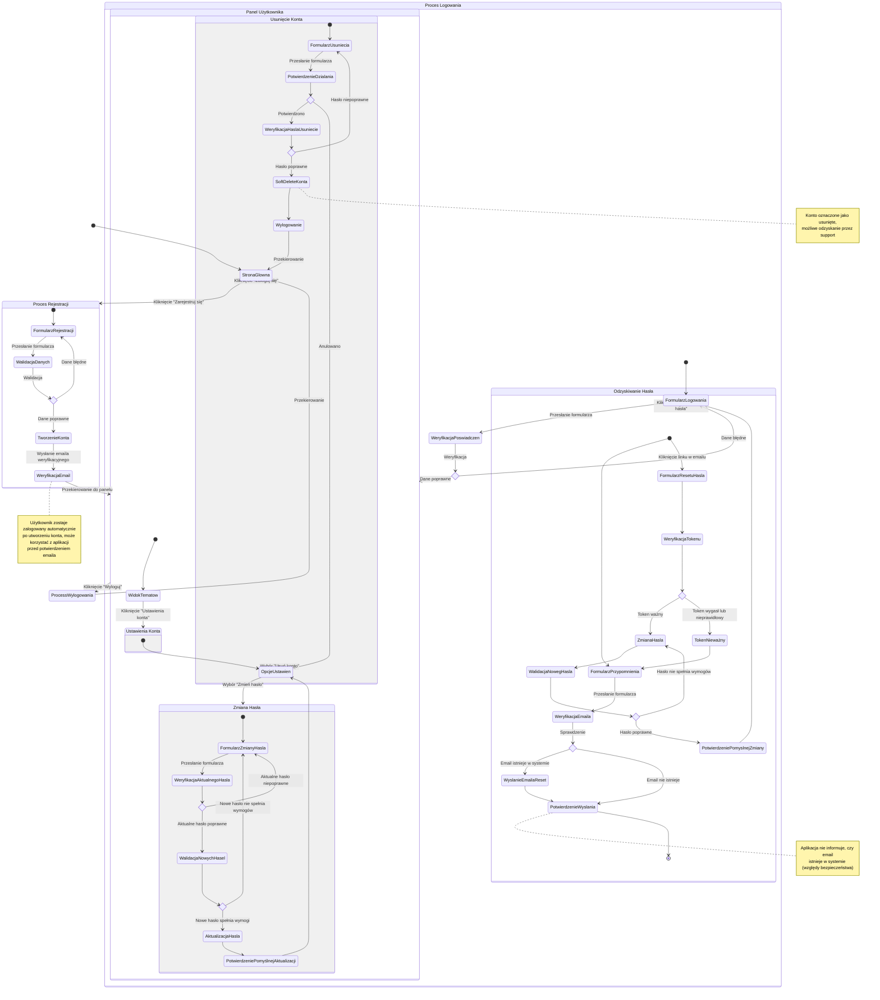

<user_journey_analysis>
## Analiza podróży użytkownika

### Ścieżki użytkownika wymienione w dokumentacji
1. **Rejestracja użytkownika** (US-001)
   - Wprowadzenie adresu e-mail i hasła
   - Spełnienie wymagań bezpieczeństwa hasła
   - Weryfikacja unikalności e-maila
   - Automatyczne logowanie po rejestracji
   - Przekierowanie do głównego widoku aplikacji

2. **Logowanie użytkownika** (US-002)
   - Wprowadzenie zarejestrowanego adresu e-mail i hasła
   - Weryfikacja danych logowania
   - Przekierowanie do głównego widoku aplikacji po sukcesie

3. **Odzyskiwanie zapomnianego hasła** (US-003)
   - Wprowadzenie adresu e-mail na stronie "Zapomniałem hasła"
   - Otrzymanie e-maila z linkiem do resetowania hasła
   - Ustawienie nowego hasła spełniającego wymagania bezpieczeństwa
   - Logowanie z nowym hasłem

4. **Zmiana hasła przez zalogowanego użytkownika** (US-004)
   - Dostęp do sekcji ustawień konta
   - Wprowadzenie aktualnego hasła oraz nowego hasła (dwukrotnie)
   - Weryfikacja poprawności aktualnego hasła
   - Potwierdzenie zmiany hasła

5. **Usuwanie konta użytkownika** (US-005)
   - Dostęp do opcji usunięcia konta w ustawieniach
   - Potwierdzenie chęci usunięcia konta (poprzez hasło)
   - Oznaczenie konta jako usunięte (soft delete)
   - Informacja o możliwości odzyskania konta przez kontakt z supportem

### Główne podróże i ich odpowiadające stany
1. **Proces Rejestracji**
   - Stan początkowy: Formularz rejestracji
   - Stany pośrednie: Walidacja danych, Tworzenie konta
   - Stany końcowe: Sukces (przekierowanie do panelu głównego) lub Błąd (ponowna próba)
   - Punkty decyzyjne: Poprawność danych formularza, Unikalność e-maila

2. **Proces Logowania**
   - Stan początkowy: Formularz logowania
   - Stany pośrednie: Weryfikacja danych
   - Stany końcowe: Sukces (przekierowanie do panelu głównego) lub Błąd (ponowna próba)
   - Punkty decyzyjne: Poprawność danych logowania

3. **Odzyskiwanie hasła**
   - Stan początkowy: Formularz przypomnienia hasła
   - Stany pośrednie: Wysłanie e-maila, Formularz resetowania, Walidacja tokenu
   - Stany końcowe: Sukces (przekierowanie do logowania) lub Błąd (wygaśnięcie tokenu)
   - Punkty decyzyjne: Istnienie e-maila w systemie, Ważność tokenu resetowania

4. **Zmiana hasła**
   - Stan początkowy: Formularz zmiany hasła
   - Stany pośrednie: Weryfikacja aktualnego hasła, Walidacja nowego hasła
   - Stany końcowe: Sukces (potwierdzenie zmiany) lub Błąd (niepoprawne hasło)
   - Punkty decyzyjne: Poprawność aktualnego hasła, Spełnienie wymagań przez nowe hasło

5. **Usuwanie konta**
   - Stan początkowy: Formularz usunięcia konta
   - Stany pośrednie: Potwierdzenie, Weryfikacja hasła
   - Stany końcowe: Sukces (wylogowanie i przekierowanie) lub Anulowanie (powrót do ustawień)
   - Punkty decyzyjne: Potwierdzenie przez użytkownika, Poprawność hasła

### Punkty decyzyjne i alternatywne ścieżki
1. **Dane formularza poprawne?** - rozgałęzienie na sukces/błąd w każdym formularzu
2. **E-mail istnieje w systemie?** - weryfikacja podczas logowania i resetu hasła
3. **Token resetu ważny?** - weryfikacja podczas procesu resetowania hasła
4. **Aktualne hasło poprawne?** - weryfikacja przy zmianie hasła i usuwaniu konta
5. **Użytkownik potwierdza akcję?** - potwierdzenie przy krytycznych operacjach

### Cel każdego stanu
1. **Formularze wprowadzania danych** - zbieranie niezbędnych informacji od użytkownika
2. **Stany walidacji** - zapewnienie poprawności i bezpieczeństwa operacji
3. **Stany weryfikacji tokenów** - potwierdzenie tożsamości użytkownika i ważności żądania
4. **Stany potwierdzenia/sukcesu** - informowanie użytkownika o powodzeniu operacji
5. **Stany błędu** - informowanie o problemach i umożliwienie ich naprawy
6. **Stany przekierowania** - nawigacja użytkownika do właściwego kontekstu po operacji
</user_journey_analysis>

<mermaid_diagram>

</mermaid_diagram>
