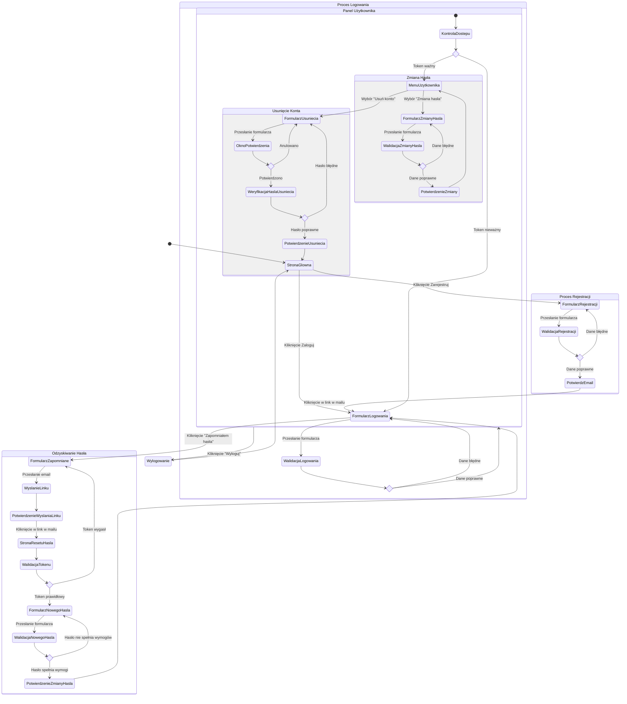

<user_journey_analysis>
1. Scieżki użytkownika:
   - Rejestracja (US-001)
   - Logowanie (US-002)
   - Zapomniane hasło / reset hasła (US-003)
   - Zmiana hasła (US-004)
   - Usunięcie konta (US-005)

2. Główne podróże i stany:
   - Proces Rejestracji: formularz → walidacja → sukces / błąd → przekierowanie
   - Proces Logowania: formularz → walidacja → sukces / błąd → przekierowanie
   - Odzyskiwanie hasła: formularz email → wysłanie linku → formularz resetu → walidacja tokenu → zmiana hasła
   - Zmiana hasła: formularz zmiany → walidacja danych → re-autoryzacja → aktualizacja hasła
   - Usuwanie konta: formularz usunięcia → potwierdzenie → re-autoryzacja → soft delete → wylogowanie

3. Punkty decyzyjne:
   - Dane formularza poprawne?
   - E-mail istnieje w systemie?
   - Token resetu ważny?
   - Aktualne hasło poprawne?
   - Użytkownik potwierdza usunięcie?

4. Opis każdego stanu:
   - Formularz...: wyświetlenie pola do wprowadzenia danych
   - Walidacja...: sprawdzenie poprawności danych po stronie klienta/serwera
   - Re-autoryzacja: ponowna weryfikacja obecnego hasła w Supabase
   - Wysłanie linku: generowanie i wysyłka emaila resetującego
   - Soft delete: oznaczenie konta jako usunięte i wyczyszczenie sesji
</user_journey_analysis>

<mermaid_diagram>

</mermaid_diagram>
