<architecture_analysis>
## Analiza architektury systemu

### Komponenty wymienione w specyfikacji
1. **Layouty**
   - `AuthLayout.astro` - layout dla stron autentykacji bez nawigacji
   - `Layout.astro` - główny layout z paskiem nawigacyjnym dla zalogowanych użytkowników

2. **Strony Astro**
   - `register.astro` - strona rejestracji nowego użytkownika
   - `login.astro` - strona logowania
   - `forgot-password.astro` - strona przypomnienia hasła
   - `reset-password/[token].astro` - strona resetowania hasła z tokenem weryfikacyjnym
   - `account/change-password.astro` - strona zmiany hasła dla zalogowanego użytkownika
   - `account/delete-account.astro` - strona usunięcia konta

3. **Komponenty React**
   - `RegisterForm.tsx` - formularz rejestracji z walidacją danych
   - `LoginForm.tsx` - formularz logowania
   - `ForgotPasswordForm.tsx` - formularz przypomnienia hasła
   - `ResetPasswordForm.tsx` - formularz resetowania hasła
   - `ChangePasswordForm.tsx` - formularz zmiany hasła
   - `DeleteAccountForm.tsx` - formularz usunięcia konta z potwierdzeniem
   - `MobileNavigation.tsx` - nawigacja mobilna
   - `Sidebar.tsx` - boczny panel nawigacyjny dla widoku desktopowego
   - `ToastManager.tsx` - komponent do wyświetlania powiadomień

### Główne strony i ich odpowiadające komponenty
1. **Strony rejestracji i logowania**
   - `register.astro` wykorzystuje `RegisterForm.tsx` dla interaktywnego formularza
   - `login.astro` wykorzystuje `LoginForm.tsx` dla obsługi logowania
   - Obie strony korzystają z `AuthLayout.astro`

2. **Strony zarządzania hasłem**
   - `forgot-password.astro` wykorzystuje `ForgotPasswordForm.tsx`
   - `reset-password/[token].astro` wykorzystuje `ResetPasswordForm.tsx`
   - `account/change-password.astro` wykorzystuje `ChangePasswordForm.tsx`
   
3. **Strona usuwania konta**
   - `account/delete-account.astro` wykorzystuje `DeleteAccountForm.tsx`
   - Zawiera komponent potwierdzenia z wprowadzeniem hasła

### Przepływ danych między komponentami
1. **Komunikacja klient-serwer**
   - Formularze React wysyłają żądania do endpointów API (`/api/auth/*`)
   - API serwera komunikuje się z Supabase Auth
   - Middleware weryfikuje tokeny sesji przed dostępem do chronionych stron
   - Odpowiedzi z serwera są przetwarzane w komponentach React

2. **Stan aplikacji**
   - Tokeny sesji przechowywane w cookies HttpOnly
   - Middleware weryfikuje stan sesji i udostępnia dane przez Astro.locals
   - Komponenty React otrzymują dane sesji przez props z komponentów Astro

3. **Walidacja**
   - Walidacja formularzy odbywa się zarówno po stronie klienta (JS) jak i serwera
   - Błędy walidacji przekazywane są do komponentów formularzy do wyświetlenia

### Funkcjonalność poszczególnych komponentów
1. **Layouty**
   - `AuthLayout.astro` zapewnia prosty wygląd stron autoryzacji bez nawigacji
   - `Layout.astro` zawiera nawigację i strukturę dla zalogowanych użytkowników

2. **Formularze React**
   - Obsługują wprowadzanie danych przez użytkownika
   - Przeprowadzają walidację danych wejściowych
   - Komunikują się z API poprzez hooki
   - Wyświetlają komunikaty o błędach i sukcesie

3. **Komponenty nawigacyjne**
   - Dostosowują wyświetlane opcje w zależności od stanu zalogowania
   - Zapewniają dostęp do ustawień konta i opcji wylogowania

```mermaid
flowchart TD
    %% Główne layouty aplikacji
    subgraph "Layouty"
        L1["Layout.astro"] -.-> L2["AuthLayout.astro"]
        L1 --> NAV["Komponenty nawigacyjne"]
        L2 --> AUTH["Komponenty autoryzacji"]
    end
    
    subgraph "Komponenty nawigacyjne"
        NAV --> SB["Sidebar.tsx"]
        NAV --> MN["MobileNavigation.tsx"]
        NAV --> TM["ToastManager.tsx"]
        
        SB --> PROFILE["Przycisk profilu"]
        MN --> PROFILE
    end
    
    subgraph "Strony Astro"
        AUTH --> LOGIN["login.astro"]
        AUTH --> REG["register.astro"]
        AUTH --> FP["forgot-password.astro"]
        AUTH --> RP["reset-password/[token].astro"]
        
        L1 --> ACCT["account/settings.astro"]
        ACCT --> CP["change-password.astro"]
        ACCT --> DA["delete-account.astro"]
    end
    
    subgraph "Komponenty React Auth"
        LOGIN --> LOGINFORM["LoginForm.tsx"]
        REG --> REGFORM["RegisterForm.tsx"]
        FP --> FPFORM["ForgotPasswordForm.tsx"]
        RP --> RPFORM["ResetPasswordForm.tsx"]
        CP --> CPFORM["ChangePasswordForm.tsx"]
        DA --> DAFORM["DeleteAccountForm.tsx"]
        
        LOGINFORM --> FORMCOMP["Wspólne komponenty formularzy"]
        REGFORM --> FORMCOMP
        FPFORM --> FORMCOMP
        RPFORM --> FORMCOMP
        CPFORM --> FORMCOMP
        DAFORM --> FORMCOMP
        
        FORMCOMP --> VALID["Komponenty walidacji"]
        FORMCOMP --> UI["Elementy UI"]
    end
    
    subgraph "Wspólne komponenty UI"
        UI --> BUTTON["Button"]
        UI --> INPUT["Input"]
        UI --> TOAST["Toast"]
        UI --> DIALOG["Dialog"]
        UI --> LABEL["Label"]
    end
    
    subgraph "Middleware i API"
        MW["Middleware"] --> PROTECT["protectRoute"]
        MW --> REFRESH["refreshToken"]
        
        LOGINFORM --> APIL["api/auth/login"]
        REGFORM --> APIR["api/auth/register"]
        FPFORM --> APIFP["api/auth/forgot-password"]
        RPFORM --> APIRP["api/auth/reset-password"]
        CPFORM --> APICP["api/auth/change-password"]
        DAFORM --> APIDA["api/auth/delete-account"]
        
        APIL --> DB["Supabase Auth"]
        APIR --> DB
        APIFP --> DB
        APIRP --> DB
        APICP --> DB
        APIDA --> DB
        
        MW --> DB
    end
    
    %% Przepływ danych
    PROFILE -->|Zalogowany| ACCT
    PROFILE -->|Niezalogowany| LOGIN
    ACCT -->|Chroniony zasób| MW
    
    %% Relacje funkcjonalne
    LOGINFORM -->|Sukces| TM
    REGFORM -->|Sukces| TM
    FPFORM -->|Sukces| TM
    RPFORM -->|Sukces| TM
    CPFORM -->|Sukces| TM
    DAFORM -->|Sukces| TM
    
    %% Stylizacja komponentów
    classDef layout fill:#131924,stroke:#02de0a,stroke-width:2px,color:#dddddd
    classDef page fill:#131924,stroke:#0602de,stroke-width:2px,color:#dddddd
    classDef component fill:#1a2233,stroke:#02de0a,stroke-width:2px,color:#dddddd
    classDef api fill:#131924,stroke:#6002db,stroke-width:2px,color:#dddddd
    classDef db fill:#1a2233,stroke:#6002db,stroke-width:2px,color:#dddddd
    
    class L1,L2,NAV,AUTH layout
    class LOGIN,REG,FP,RP,CP,DA,ACCT page
    class LOGINFORM,REGFORM,FPFORM,RPFORM,CPFORM,DAFORM,FORMCOMP,SB,MN,TM,PROFILE,UI,VALID component
    class APIL,APIR,APIFP,APIRP,APICP,APIDA,MW,PROTECT,REFRESH api
    class DB db
```

</architecture_analysis>

<mermaid_diagram>

</mermaid_diagram>
flowchart TD
    subgraph "Layouts"
        AuthLayout["AuthLayout.astro"]
        Layout["Layout.astro"]
    end
    subgraph "Strony Astro"
        RegPage["register.astro"] --> RegForm["RegisterForm.tsx"]
        LogPage["login.astro"] --> LogForm["LoginForm.tsx"]
        ForgotPage["forgot-password.astro"] -->
          ForgotForm["ForgotPasswordForm.tsx"]
        ResetPage["reset-password [token]"] -->
          ResetForm["ResetPasswordForm.tsx"]
        ChangePage["change-password.astro"] -->
          ChangeForm["ChangePasswordForm.tsx"]
        DeletePage["delete-account.astro"] -->
          DeleteForm["DeleteAccountForm.tsx"]
    end
    subgraph "Komponenty React"
        RegForm --> APIReg["API: register"]
        LogForm --> APILog["API: login"]
        ForgotForm --> APIForgot["API: forgot pw"]
        ResetForm --> APIReset["API: reset pw"]
        ChangeForm --> APIChange["API: change pw"]
        DeleteForm --> APIDelete["API: delete acct"]
    end
    subgraph "SSR Middleware"
        Middleware["protectRoute"]
        Middleware --> Layout
    end
    subgraph "API Endpoints"
        APIReg --> RegEndpoint["POST auth/register"]
        APILog --> LogEndpoint["POST auth/login"]
        APIForgot --> ForgotEndpoint["POST auth/forgot-password"]
        APIReset --> ResetEndpoint["POST auth/reset-password"]
        APIChange --> ChangeEndpoint["PUT auth/change-password"]
        APIDelete --> DeleteEndpoint["DELETE auth/delete-account"]
    end
</mermaid_diagram>