<architecture_analysis>
1. Komponenty wymienione w specyfikacji:
   - Layouty: AuthLayout.astro, Layout.astro
   - Strony Astro: register.astro, login.astro,
     forgot-password.astro, reset-password/[token].astro,
     account/change-password.astro, account/delete-account.astro
   - Komponenty React: RegisterForm.tsx,
     LoginForm.tsx, ForgotPasswordForm.tsx,
     ResetPasswordForm.tsx, ChangePasswordForm.tsx,
     DeleteAccountForm.tsx
   - NavBar z przyciskami logowania/profilu
2. Główne strony i odpowiadające im komponenty:
   - register.astro → RegisterForm.tsx
   - login.astro → LoginForm.tsx
   - forgot-password.astro → ForgotPasswordForm.tsx
   - reset-password → ResetPasswordForm.tsx
   - change-password → ChangePasswordForm.tsx
   - delete-account → DeleteAccountForm.tsx
3. Przepływ danych:
   - Formularze React wywołują endpointy API auth
     (/api/auth/*)
   - Layout.astro wykorzystuje middleware protectRoute
     do ochrony stron
   - AuthLayout.astro renderuje strony auth bez NavBar
4. Opis funkcjonalności:
   - AuthLayout i Layout kontrolują widoczność UI
   - Formularze walidują dane i wysyłają żądania
   - NavBar zmienia przyciski w zależności od sesji

```mermaid
flowchart TD
    %% Layouty główne
    L1[Layout.astro] --> S1[Sidebar.tsx]
    L1 --> M1[MobileNavigation.tsx]
    L1 --> MB[Main Content]
    
    L2[AuthLayout.astro] --> AB[Auth Content]
    
    %% Strony Astro
    subgraph "Strony Autoryzacji"
        R1[register.astro] --> RF[RegisterForm.tsx]
        L3[login.astro] --> LF[LoginForm.tsx]
        FP[forgot-password.astro] --> FPF[ForgotPasswordForm.tsx]
        RP["reset-password/[token].astro"] --> RPF[ResetPasswordForm.tsx]
        CP["account/change-password.astro"] --> CPF[ChangePasswordForm.tsx]
        DA["account/delete-account.astro"] --> DAF[DeleteAccountForm.tsx]
    end
    
    %% Komponenty autoryzacji
    subgraph "Komponenty React Autoryzacji"
        RF --> V1[Walidacja Email]
        RF --> V2[Walidacja Hasła]
        RF --> PS[PasswordStrength]
        
        LF --> V1
        FPF --> V1
        
        RPF --> V2
        RPF --> PS
        
        CPF --> V2
        CPF --> PS
        
        DAF --> D1[Dialog potwierdzenia]
    end
    
    %% Middleware i API
    subgraph "System Autoryzacji"
        MW[Middleware] --> PR[protectRoute]
        MW --> RT[refreshToken]
        
        API["API (/api/auth/)"] --> MW
        
        PR --> IS[isSession]
        RT --> IS
    end
    
    %% Powiązania funkcji
    L3 -.-> API
    R1 -.-> API
    FP -.-> API
    RP -.-> API
    CP -.-> API
    DA -.-> API
    
    %% Nawigacja
    S1 --> CP
    M1 --> CP
    M1 --> DA
    
    %% Stylizacja
    classDef page fill:#131924,stroke:#0602de,stroke-width:2px
    classDef component fill:#1a2233,stroke:#02de0a,stroke-width:2px
    classDef middleware fill:#1a2233,stroke:#6002db,stroke-width:2px
    
    class R1,L3,FP,RP,CP,DA,L1,L2 page
    class RF,LF,FPF,RPF,CPF,DAF,S1,M1,V1,V2,PS,D1 component
    class MW,PR,RT,IS,API middleware
```

</architecture_analysis>

<mermaid_diagram>

flowchart TD
    subgraph "Layouts"
        AuthLayout["AuthLayout.astro"]
        Layout["Layout.astro"]
    end
    subgraph "Strony Astro"
        RegPage["register.astro"] --> RegForm["RegisterForm.tsx"]
        LogPage["login.astro"] --> LogForm["LoginForm.tsx"]
        ForgotPage["forgot-password.astro"] -->
          ForgotForm["ForgotPasswordForm.tsx"]
        ResetPage["reset-password [token]"] -->
          ResetForm["ResetPasswordForm.tsx"]
        ChangePage["change-password.astro"] -->
          ChangeForm["ChangePasswordForm.tsx"]
        DeletePage["delete-account.astro"] -->
          DeleteForm["DeleteAccountForm.tsx"]
    end
    subgraph "Komponenty React"
        RegForm --> APIReg["API: register"]
        LogForm --> APILog["API: login"]
        ForgotForm --> APIForgot["API: forgot pw"]
        ResetForm --> APIReset["API: reset pw"]
        ChangeForm --> APIChange["API: change pw"]
        DeleteForm --> APIDelete["API: delete acct"]
    end
    subgraph "SSR Middleware"
        Middleware["protectRoute"]
        Middleware --> Layout
    end
    subgraph "API Endpoints"
        APIReg --> RegEndpoint["POST auth/register"]
        APILog --> LogEndpoint["POST auth/login"]
        APIForgot --> ForgotEndpoint["POST auth/forgot-password"]
        APIReset --> ResetEndpoint["POST auth/reset-password"]
        APIChange --> ChangeEndpoint["PUT auth/change-password"]
        APIDelete --> DeleteEndpoint["DELETE auth/delete-account"]
    end
</mermaid_diagram>